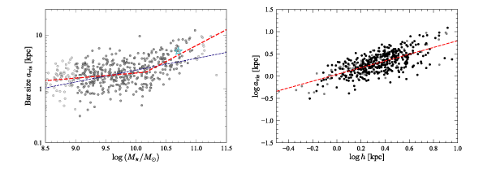

# Public data, code, and notebooks for bar-sizes paper using S4G data

This git repository contains data files, Python code, and Python Jupyter
notebooks which can be used to reproduce figures and analyses from the
paper ["What Determines the Sizes of Bars in Spiral
Galaxies?"](https://www.mpe.mpg.de/~erwin/temp/s4g_barsizes.pdf) (Erwin
2019, *Monthly Notices of the Royal Astronomical Society*, submitted).
<!-- [arXiv:19xx.xxx](https://arxiv.org/abs/19xx.xxx)). -->

(This figure, combining two plots from the paper, shows the
(deprojected) size of bars from the local, S4G-based sample studied in
the paper as a function stellar mass (left) and as a function of
exponential disk scale length (right). The logarithm of bar size is a
broken-linear function of the logarithm of stellar mass, and a simple
linear function of the logarithm of exponential disk scale length (dashed
red lines in both panels; the dashed blue line in the left panel shows
the best linear fit). The
cyan star in the left-hand panel shows the location of the Milky Way's
bar, assuming a bar semi-major axis of 5 kpc and a galaxy stellar mass
of 5 &times; 1010 solar masses.)

## Dependencies

The Python code and notebooks require the following external Python modules and packages,
all of which are available on PyPI and can be installed via `pip`:

   * [Numpy](https://www.numpy.org), [Scipy](https://www.scipy.org), [matplotlib](https://matplotlib.org)
   * Michele Cappellari's LOESS code: [`cap_loess_1d`](http://www-astro.physics.ox.ac.uk/~mxc/software/#loess)

## Jupyter Notebooks

There are two Jupyter Python notebooks:

   * `barsize_fits.ipynb` -- generates (and saves to a text file) various fits

   * `barsizes_figures_for_paper.ipynb` -- generates the figures for the paper (using
   fit coefficients saved by the first notebook)

## Python Code

   * `datasets.py`, `datautils.py`, `plotutils.py`, `s4gutils.py` -- miscellaneous utility functions
   (including statistics).
   
   * `sample_defs.py` -- definitions of various subsamples of S4G galaxies, in the
   form of integer lists of index values (slices, more or less).
   
   * `fitting_barsizes.py` -- code to assist with the fits in the Jupyter notebook
   `barsize_fits.ipynb`.

   * `make_fit_tables.py` -- code to generate LaTeX tables for the paper

## How to Generate Figures and Analyses from the Paper

1. Download this repository.

2. Edit paths in the notebooks so they point to the correct locations, if necessary.
See notes in the initial cells of the notebooks; the main variable you will probably
need to edit is `plotDir` in the second cell of `barsizes_figures_for_paper.ipynb`,
which is where saved PDF figures should go. Also make sure to set `savePlots = True`
if you want the PDF files to actually be generated (the default is `False`, which
means the figures will appear in the notebook but won't be saved to disk).

3. **Optionally:** Run the notebook `barsize_fits.ipynb` to generate and
save the various fits. (Note that MSE_pred values and parameter
uncertainties may change slightly, since they are based on bootstrap
resampling.) This is "optional" in that the output files already exist
in this directory (they will be overwritten if the notebook is run).

4. Run the notebook `barsizes_figures_for_paper.ipynb` to generate the figures
(it will read the coefficients of the fits from the file generated by running the
previous notebook).

## Licensing

Code in this repository is released under the BSD 3-clause license.

 
Text and figures are licensed under a <a rel="license" href="http://creativecommons.org/licenses/by/4.0/">Creative Commons Attribution 4.0 International License</a>.
