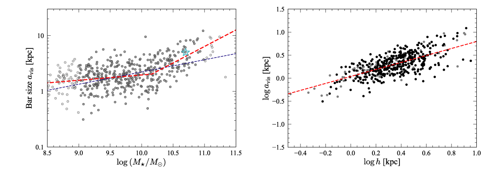

# Public data, code, and notebooks for bar-sizes paper using S4G data

This git repository contains data files, Python code, and Python Jupyter
notebooks which can be used to reproduce figures and analyses from the
paper ["What Determines the Sizes of Bars in Spiral
Galaxies?"](https://www.mpe.mpg.de/~erwin/temp/s4g_barsizes.pdf) (Erwin
2019, *Monthly Notices of the Royal Astronomical Society*, submitted; [arXiv:19xx.xxx](https://arxiv.org/abs/19xx.xxx)).

<!-- 
The `data/` subdirectory contains text-file tables with various data compilations
and simulation outputs; see the README.md file there for details.
 -->

(This figure, combining two plots from the paper, shows the size of bars
from the local, S4G-based sample studied in the paper as a function
stellar mass (left) and as a function of exponential disk scale length
(right). The cyan star in the left-hand panel shows the location of the
Milky Way's bar, assuming a bar semi-major axis of 5 kpc and a stellar mass
of 5 x 10^10 solar masses.)

## Dependencies

The Python code and notebooks require the following external Python modules and packages,
all of which are available on PyPI and can be installed via `pip`:

   * [Numpy](https://www.numpy.org), [Scipy](https://www.scipy.org), [matplotlib](https://matplotlib.org)
   * Michele Cappellari's LOESS code: [`cap_loess_1d`](http://www-astro.physics.ox.ac.uk/~mxc/software/#loess)

## Jupyter Notebooks

There are two Python notebooks:

   * `barsize_fits.ipynb` -- generates (and saves to a text file) various fits

   * `barsizes_figures_for_paper.ipynb` -- generates the figures for the paper

## Python Code

   * `datasets.py`, `datautils.py`, `plotutils.py`, `s4gutils.py` -- miscellaneous utility functions
   (including statistics).
   
   * `sample_defs.py` -- definitions of various subsamples of S4G galaxies, in the
   form of integer lists of index values (slices, more or less).
   
   * `fitting_barsizes.py` -- code to assist with the fits in the Jupyter notebook
   `barsize_fits.ipynb`.

   * `make_fit_tables.py` -- code to generate LaTeX tables for the paper

## Licensing

Code in this repository is released under the BSD 3-clause license.

 
Text and figures are licensed under a <a rel="license" href="http://creativecommons.org/licenses/by/4.0/">Creative Commons Attribution 4.0 International License</a>.
